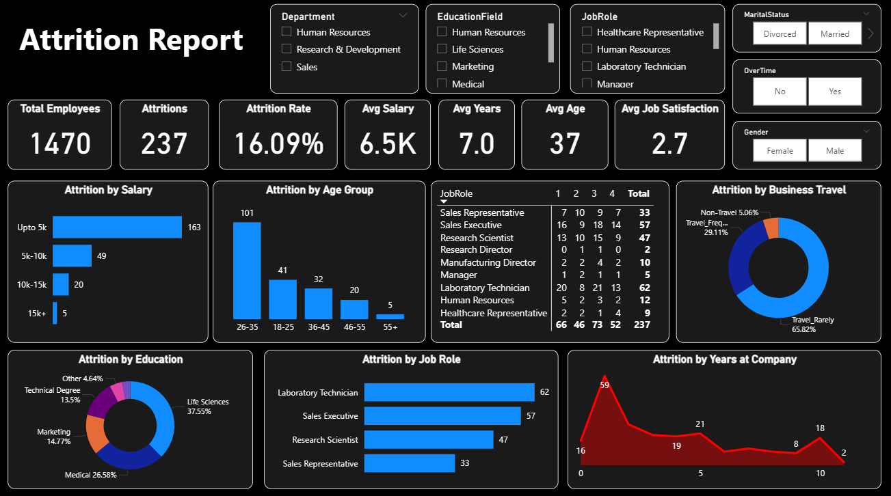
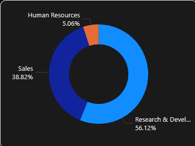

# HR Analytics Dashboard

**Project Title**
Power BI Interactive Attrition Report for HR Analytics Dataset

**Table of Contents**

1. [Overview](#overview)
2. [Dataset](#dataset)
3. [Data Preprocessing](#data-preprocessing)
4. [Key Features and Visualizations](#key-features-and-visualizations)
5. [Screenshots](#screenshots)
6. [Prerequisites](#prerequisites)
7. [Installation](#installation)
8. [Usage](#usage)
9. [Customization](#customization)
10. [DAX Measures](#dax-measures)
11. [Project Structure](#project-structure)
12. [Contact](#contact)

---

## Overview

This repository hosts a Power BI dashboard built on the **HR\_Analytics.csv** dataset. The interactive **Attrition Report** helps HR teams explore employee attrition trends across salary bands, age groups, job roles, and more. Filters by department, education field, job role, marital status, overtime, and gender allow dynamic cross-filtering for deeper insights.

## Dataset

* **Name:** HR\_Analytics.csv
* **Source:** [Kaggle HR Analytics Dataset](https://www.kaggle.com/code/xokent/hr-analytics-dataset-eda/input)
* **Format:** CSV
* **Size:** \~1,470 records with 35+ fields including demographics, job role, education, and attrition status.

## Data Preprocessing

Data cleaning and preprocessing were performed in Python before importing into Power BI. The main steps include:

1. **Importing Libraries**

   ```python
   import pandas as pd
   import numpy as np
   ```
2. **Loading Raw Data**

   * Renamed original CSV to `Raw Data.csv` and placed in `data/`.

   ```python
   df = pd.read_csv('data/Raw Data.csv')  
   print(df.shape)  
   df.head()  
   df.describe()  
   df.info()
   ```
3. **Handling Missing Values**

   * Filled blank entries in `YearsWithCurrManager` with the column mean.

   ```python
   mean_value = int(df['YearsWithCurrManager'].mean())  
   df['YearsWithCurrManager'] = df['YearsWithCurrManager'].fillna(mean_value)
   ```
4. **Removing Duplicates**

   * Dropped duplicate rows.

   ```python
   df = df.drop_duplicates()
   ```
5. **Handling Invalid Values**

   * Standardized `BusinessTravel` category name.

   ```python
   df['BusinessTravel'] = df['BusinessTravel'].replace('TravelRarely', 'Travel_Rarely')
   ```
6. **Saving Cleaned Data**

   * Exported cleaned dataframe to CSV for Power BI ingestion.

   ```python
   df.to_csv('data/Cleaned Data.csv', index=False)
   ```

The cleaned file `Cleaned Data.csv` is used as the source in the Power BI report.

## Key Features and Visualizations

* **KPI Cards:** Total Employees, Total Attritions, Attrition Rate, Average Salary, Average Years, Average Age, Average Job Satisfaction.
* **Bar Chart:** Attrition by Salary Bands (Upto 5k, 5k–10k, 10k–15k, 15k+).
* **Bar Chart:** Attrition by Age Group (18–25, 26–35, 36–45, 46–55, 55+).
* **Donut Charts:** Attrition by Business Travel, Education Field, Department.
* **Horizontal Bar Chart:** Attrition by Job Role.
* **Line Chart:** Attrition by Years at Company.
* **Matrix Table:** Attrition counts by Job Role and Performance Rating (1–4).
* **Interactive Filters:** Department, EducationField, JobRole, MaritalStatus, OverTime, Gender.

## Screenshots

### Main Attrition Report



### Tooltip and Drill-through Page




## Prerequisites

* Power BI Desktop (version 2.XX or later)
* Python 3.x (for running the preprocessing notebook)

## Installation

1. **Clone the repository**

   ```bash
   git clone https://github.com/ChaitanyaRawat/attrition-hr-analytics.git
   cd attrition-hr-analytics
   ```

2. **Run Python preprocessing script**

   * Open `preprocessing.ipynb` using Jupyter Notebook or VS Code.
   * Execute all cells to generate the cleaned dataset.

3. **Open in Power BI Desktop**

   * Launch Power BI Desktop.
   * Open `Attrition Dashboard.pbix` from the project root.

## Usage

1. Use the **Filters pane** on the right to select or deselect values.
2. Click on any visual element to cross-filter all other charts.
3. Right-click a data point and choose **Drill through** → **Tooltip Page** for detailed breakdown.

## Customization

* **Modify DAX Measures:** In the **Fields** pane, expand the **Cleaned Data** table, right-click a measure (e.g., `Attrition_Rate`), and choose **Edit measure**.
* **Add New Visuals:** Drag additional fields onto the canvas or insert new chart types from the visualization pane.
* **Update Theme:** Under the **View** tab, select a new report theme or create a custom one.

## DAX Measures

```DAX
-- Count of employees who left
Attrition_Count = IF('Cleaned Data'[Attrition] = "Yes", 1, 0)

-- Attrition rate as percentage
Attrition_Rate = SUM('Cleaned Data'[Attrition_Count]) / SUM('Cleaned Data [EmployeeCount])
```


## Project Structure

```
├── assets/                # Dashboard screenshots and supporting images
│   ├── attrition-report.png
│   └── tooltip-page.png
├── data/                  
│   └── Cleaned Data.csv   # Cleaned and Preprocessed Data
│   └── Raw Data.csv       # Raw and Uncleaned Data
├── preprocessing.ipynb    # Python notebook for data cleaning
├── Attrition Dashboard.pbix            # Power BI report file
└── README.md              # Project documentation
```


## Contact

* **Author:** Chaitanya Rawat
* **GitHub:** [ChaitanyaRawat](https://github.com/ChaitanyaRawat)
* **Email:** [chaitanyarawat95@gmail.com](mailto:chaitanyarawat95@gmail.com)

---

*⭐ If you find this dashboard useful, please give it a star!*
